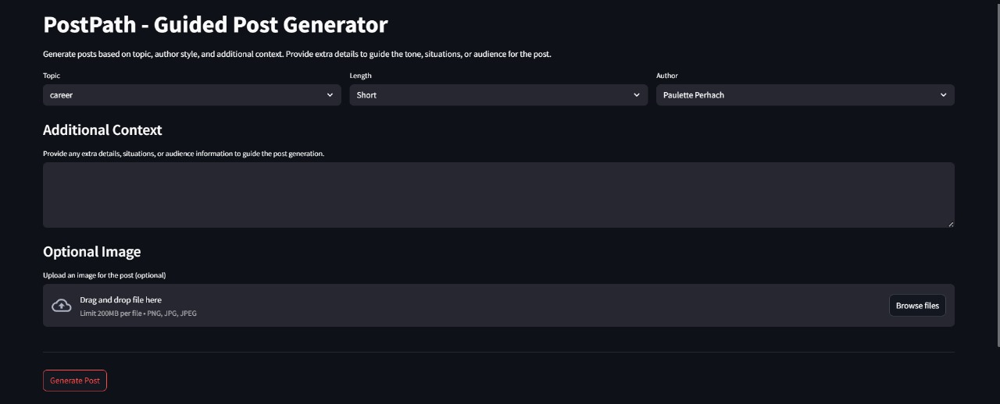

# PostPath - Guided Post Generator

 
 
 

PostPath is an AI-powered tool to generate posts using **few-shot examples** and **large language models (LLMs)**. It leverages LangChain, Groq, and Streamlit to provide a guided, customizable post-generation experience.

---

## Features

- Generate posts based on **topic**, **author style**, and **length**.
- Include **additional context** to guide tone, situations, or audience.
- Supports **few-shot learning** with examples from existing posts.
- Streamlit-based web interface for easy use.
- Uses **Groq LLM API** for content generation.
- Tag unification for consistent categorization.

---

## Tech Stack

- **Python 3.x**
- **Pandas & JSON** for data handling
- **LangChain** for prompt management
- **Groq LLM** for text generation
- **Streamlit** for web app interface
- **dotenv** for environment variable management

---

## UI Preview

(The generated posts are for **references and educational purposes only**.  This project **does not claim authorship** of real individuals’ writing, and you should **not attribute generated content to anyone else**.  )

